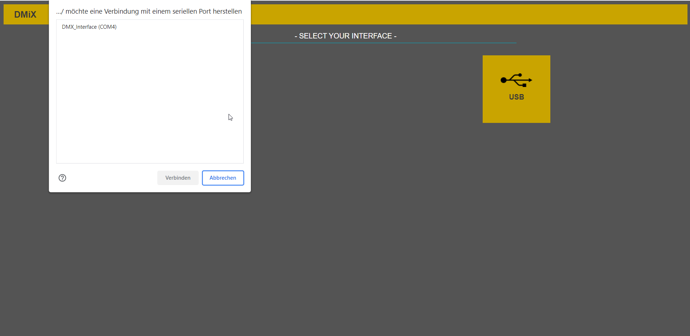
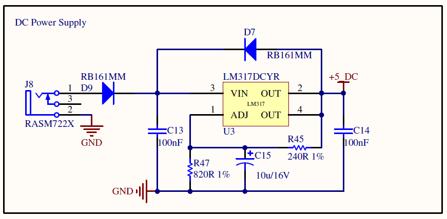
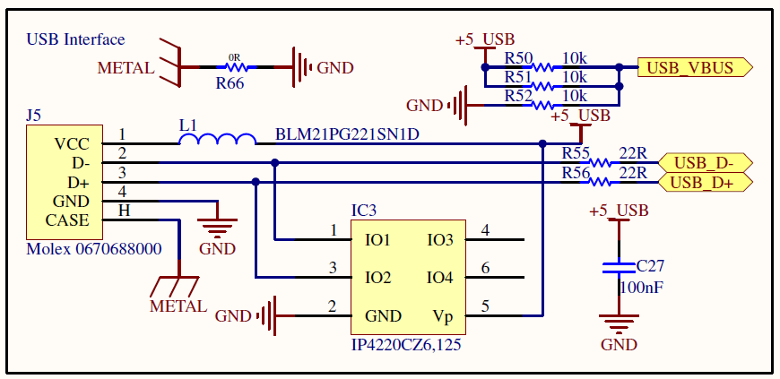
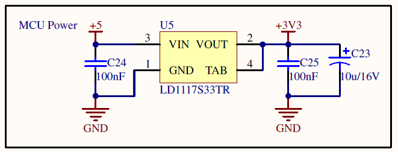
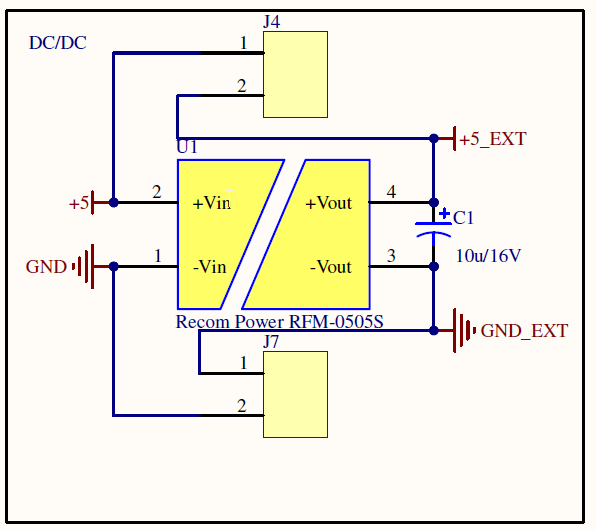
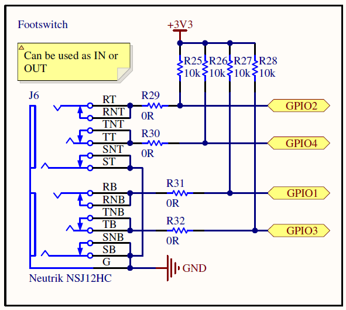
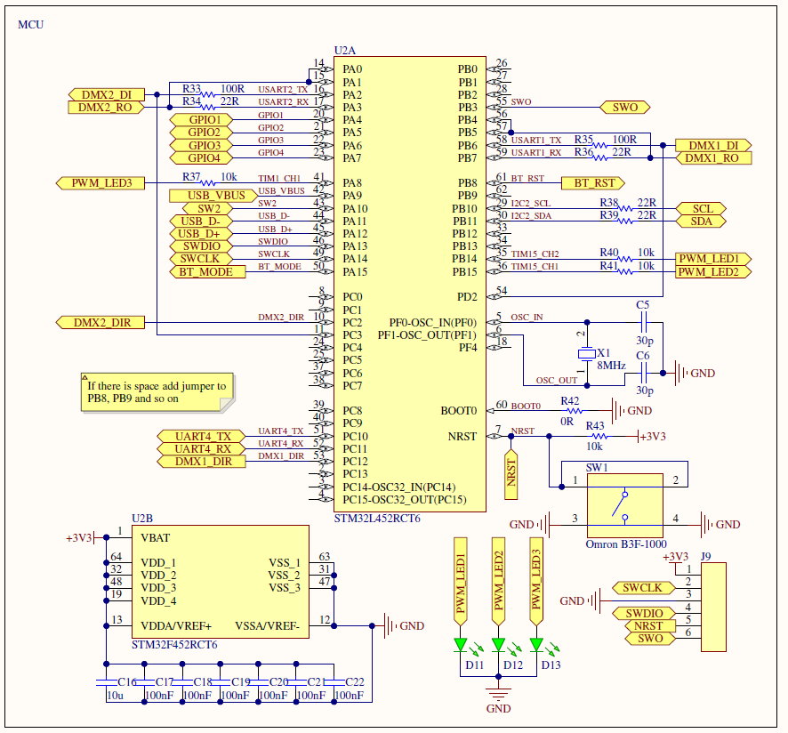

# DMiX - Artist Light Control

[TOC]

## Introduction

The DMiX Artist Light Control is for people or bands who want to make the show look like more professional. It combines the functionality of a DMX merger with a scene preset storage. This gives the possibility to integrate your lights into a bigger light system by keeping control access direct to the artists. With the small dimensions of 60mm x 140mm it can be integrated into every stage equipment and is easy to carry. The completely opto-isolated DMX transceivers ensure that the DMX bus on the stage is not affected by the DMiX itself and no ground loops can occur. 

But how does everything fit into this small product? Let take a very abstract look to the DMiX and the principle of it. After this the following uses cases make a lot more sense. Then the detailed view will give an impression about the internal work flow. 

As we see the DMiX offers some GPIOs. They are mostly used as inputs, for example a footswitch. Then there is a USB port for the internal configuration and a power supply jack. The DMiX can be either supplied by USB or a DC barrel jack. The GPIOs are tracked by the internal firmware. Based on the status of the GPIOs a dedicated light scene from the preset storage is stared and send out to the DMX bus. The internal DMX signal is then merged with received signal from DMX IN and provided on DMX OUT. If there are some lights on the stage which should not be affected by the internal light scenes, then they can be connected to DMX THROUGH. 

## Use Cases

There are several uses cases for the DMiX. Below 3 of them are listed. The first use case is the ideal use case for the DMiX and probably the most common. 

### The Singer-Songwriter

There is a small band or a singer-songwriter which plays on events or acts as wedding artist. Next to the musical aspect of the show some lights are required to give a general better performance. Here comes the flexibility of DMiX into the game. It is super small but you can still control complex light devices. As they will be only a single or a few persons they wont have an light operator so the control is completely under their control via footswitches. 

### The digital Band

The next use case is the one why the DMiX was build. Imagine a Band has a fully digital setup with a digital audio mixer and in ear systems in a rack. But to give the shows a professional look a light show matched to the music would be ideal. As semi-professional bands wont have a light operator in most cases they need some kind of automatic light control. For this approach they use a laptop to add a metronome for every song. Based on this metronome they program the light show and fire it via ArtNet. So this already works without DMiX. But as always based on the momentary feeling during the show it could make sense to add some special effects to make it a bit more dynamic. For this use case the DMX output of the ArtNet can be connected to the DMiX as well as a footswitch. The programmed light show will work perfect but if the feeling required it, the band can fire some special effects with a footswitch. No need for a light operator.  

### Shared access

The last use case is not really straight forward but could also be possible. Lets imagine now the band or singer-songwriter is playing a huge show where a light operator has access over the stage. But they still want to fire their special effects based on the feeling. Then the light operator could strip up a second independent DMX universe to the DMiX, to ensure that the main DMX universe is not affected. Now the light operator has access over the light equipment from the artist and can match the colors to the general look of the stage. But if the artist needs some special effects, no problem, just kick the footswitch and you are good to go. 

## Configuration Software

The configuration software for the DMiX is a simple web application fully written in html and javascript as single page application. This approach was used to be cross-platform and to checkout how good the web API performs. But it is also no problem to rewrite the software for Flutter or other cross-platform languages. To get access to bluetooth or the serial port there are 2 APIs available:

- https://webbluetoothcg.github.io/web-bluetooth/
- https://wicg.github.io/serial/

Both are not enabled in Chrome by default. To enable them you have to enter *chrome://flags* in the URL field and enable *Experimental Web Platform features*. 

### Video Descritpion

The video below shows how a connection to a DMiX device looks and to get in impressrion how fast and responsive the software is. A full download from the DMiX device takes only about 630ms.  

###  Interface Screen

The interface screen is as easy as is could be. There are 2 buttons. One to search DMiX devices on the USB ports and one to search them via bluetooth.

Once the button was pressed the connected DMiX devices will be listed and can be selected. If a device gets selected the software will connect to the device and downloads the whole content of the device. 

### Preset Screen

You will end up in the main screen of the software, the preset screen. Here is a lot to see but step by step. In the header is the navigation between the preset and the footswitch screen. There is also the connection icon. In this case USB. Pressing on this icon will disconnect from the DMiX.

Next there is the first configuration row. Here you can select in a dropdown menu between 10 **Presets**. This is limited at the moment but there can be more. On the right is the name for the preset. This can be changed and will be stored on the DMiX. 

Below the preset selection, we have the so called **Transitions**. There is space for 20 **Transitions** in every preset. There can be more but 20 is more than enough. Every **Transition** has 7 parameters to control:

- channel
- start 
- end 
- time
- delay 
- ramp
- active

The channel is the DMX channel and can be between 0 - 255. The start and end are the DMX values which will be applied during this **Transition**. The range is between 0 - 255. If the **Preset** is triggered it will begin from the start value and will move to the end value. The next parameter is time. This value is in milliseconds and ranges between 0 - 32767. It indicates the time to move from start to end. Then we have delay. As it implies, it is in milliseconds, ranges between 0 - 32767 and indicates when the transition should be triggered inside the **Preset**. For example we set it to 1000 and we trigger the **Preset**. Then the **Transition** won't change anything in the first second. As soon as the second is gone, the **Transition** will jump to the start value and moves to the end value with respect to time settings. The last parameter is ramp. This indicates how the **Transition** from start to end should be performed. At the moment only linear is supported but more a in planning. The last parameter is active and indicates if the specific transition is active inside the **Preset**. This is very helpful if something is not working as expected. 

### Footswitch Screen

The last screen in the software is the footswitch screen. Here comes the artist in the game. This screen gives the possibility to assign **Presets** to the 4 available GPIOs. Therefore every footswitch can trigger presets on:

- PRESSED
- RELEASED
- HOLD_SHORT
- HOLD_LONG

To select a preset there is a dropdown menu on every possible trigger point. There you can select or deselect the configured **Presets**. An important and helpful feature is the **TEST** button next to every trigger point. In this way you can easily check if the preset is really the one you want.

 

### Open topics

- Live DMX Control as interface
- More ramps like cubic or exponential 

## Firmware

### Architecture

The firmware of the DMiX is completely designed module based. Every part is encapsulated as much as possible. In general all tasks are split into separate modules which will report their status via messages to the main task, so called app task. There is no operation system running. Everything runs inside the main loop and the tasks are *eal_task*. EAL stands for *Embedded Audio Lab* under which the DMiX was developed. The *eal_tasks* are just simply structs which are containing all functions needed for a proper scheduling. 

Let do an example for a better understanding. We will take a look to the footswitches. The footcontrol task tracks periodically the status of the footswitches and debounce all of them. As soon as a footswitch transition was detected the footcontrol task will report this status via a message to the app task. The app task nows what to do and assigns this message to the dmx_preset task. This task has maybe, or maybe not, a preset assigned to the footswitch and will trigger a preset, which will end up in more messages. The module overview is shows as architecture below:

- **DMX:** Handles the DMX reception and transmission.
- **Button**: Handles the debouncing and status of the configuration switch
- **EEPROM:** Handles the storing of the user configuration
- **DMX Preset:** Processes triggered presets
- **Footcontrol:** Handles the debouncing and status of the footswitches
- **Interface:** Receives and transmitts messages to the connected interface (usb or bluetooth)
- **App Model:** Holds the full user configuration from the configuration software

### Principle of working

As the main task of the firmware is changing DMX values based on user configurations the next section explains the principle of working. In general the DMX task holds 3 sets of DMX universes. 

- **dmx2In:** This is the received data from the DMX input
- **dmxMod:** This is the data which should be modified based on user presets
- **dmx1Out:** This is the result out of **dmx2In** and **dmxMod**

If a preset was triggered the DMX preset task will send DMX value changes as messages to the app task. The app task will assign these messages to the DMX task. There the message will be parsed into new values for **dmxMod**. As the DMX task is periodically triggered it will compare the values inside **dmx2In** and **dmxMod**. Based on the selected algorithm the new value will be stored inside **dmx1Out** and send out on **DMX_MOD**. There are 2 algorithms available:

- **HTP:** Highest Takes Priority
- **LTP:** Lowest Takes Priority

As the names imply. **HTP** will check which value of both is higher and send this to **MOD_OUT**. Of course **LTP** is exactly the opposite. This gives us the functionality to merge and overwrite values inside the DMX universe. 

### Protocol Definition

The protocol structure is always the same for every message and can be seen in the table below. In total there are only 5 types of different messages. All values are send out as ASCII, so for a full byte value 2 characters are needed. 

| start  | type                                                         | index  | payload          |
| ------ | ------------------------------------------------------------ | ------ | ---------------- |
| Byte 0 | Byte 1                                                       | Byte 2 | Byte 3 - Byte 16 |
| #      | 'T': Transition  'F': Footswitch 'P': Preset 'L': Upload 'A': Acknowledge | ASCII  | Depends on type  |

#### Transition message

This is the most used message. It is send out always when the user has changed something on its transitions. As the full information of a transition does not fit into 1 messages there are actually 3 messages which cover the whole configuration. 

| start  | type   | index  | payload                                                      | end  |
| ------ | ------ | ------ | ------------------------------------------------------------ | ---- |
| Byte 0 | Byte 1 | Byte 2 | Byte 3 - Byte 16                                             | \r\n |
| #      | T      | 0      | 3-4: Preset, 5-6: Transition, 7-8: Channel, 9-10: Start      | \r\n |
| #      | T      | 1      | 3-4: Preset, 5-6: Transition, 7-8: End, 9-12: Time           | \r\n |
| #      | T      | 2      | 3-4: Preset, 5-6: Transition, 7-10: Delay, 11-12: Ramp, 13: Active | \r\n |
| #      | A      | 0      | 3-16: 0                                                      | \r\n |

On a transition change always all messages are send out. 

#### Footswitch message

The footswitch message fits into a single message. So this is send out on every footswitch configuration change. 

| start  | type   | index  | payload                                                      | end  |
| ------ | ------ | ------ | ------------------------------------------------------------ | ---- |
| Byte 0 | Byte 1 | Byte 2 | Byte 3 - Byte 16                                             | \r\n |
| #      | F      | 0      | 3-4: Footswitch, 5-6: Pressed, 7-8: Released, 9-10: Hold_Short, 11-12: Hold_Long | \r\n |

#### Preset message

The preset message has again 3 different messages. 

| start  | type   | index  | payload                              | end  |
| ------ | ------ | ------ | ------------------------------------ | ---- |
| Byte 0 | Byte 1 | Byte 2 | Byte 3 - Byte 16                     | \r\n |
| #      | P      | 0      | 3-4: Preset, 5-16: PresetString_0_8  | \r\n |
| #      | P      | 1      | 3-4: Preset, 5-16: PresetString_9_17 | \r\n |
| #      | P      | T      | 3-4: Preset                          | \r\n |

On a name change of the preset the first 2 messages are send out always. The third message will be send out when the **TEST** button in the configuration software is pressed. 

#### Upload message

The upload message is as easy as it could be. If this message it transmitted the DMiX will send out all transition, footswitch and preset messages to upload the status to the configuration software. 

| start  | type   | index  | payload          | end  |
| ------ | ------ | ------ | ---------------- | ---- |
| Byte 0 | Byte 1 | Byte 2 | Byte 3 - Byte 16 | \r\n |
| #      | L      | 0      | /                | \r\n |

#### Acknowledge message

On every received message, except and acknowledge message, the DMiX transmits and acknowledge message to report to the configuration software that everything was received and the software can send out the next message. Also the configuration software will acknowledge all received messages. If needed this could be used to implement an wait state into the DMiX. In the moment this is not used. 

| start  | type   | index  | payload          | end  |
| ------ | ------ | ------ | ---------------- | ---- |
| Byte 0 | Byte 1 | Byte 2 | Byte 3 - Byte 16 | \r\n |
| #      | A      | 0      | 00000000000000   | \r\n |

### Folder Structure

The folder structure is easy to understand when we take a look to the firmware architecture. Everything is exactly as the firmware architecture shows it. Not all middleware parts are shown in the architecture but the important ones are. 

 

### Footprint

The actual footprint of the DMiX is very small we are only using 12% of flash and 31% of ram memory. There is way enough storage for additional features. 

### Open topics

- USB Massstorage
- USB DMX Interface
- UART TXE rechecking

## Hardware

The hardware of the DMiX is designed as simple as possible while being reliable on rough stage environment. The main features are:

- Full isolated DMX interface
- 1x DMX Input Port
- 2x DMX Output Ports, 1x hardware **THROUGH** and 1x processed modified **MOD OUT**
- Transceiver-Direction-Switch, can be used for RDM
- 2x Power Supply options, 1x 9V dc barrel jack and 1x USB Port
- USB Configuration Port
- BLE Configuration Port (not used yet) 
- 4x GPIOs accessible via 6.35mm jacks, can be used as in- or outputs
- 1-Mbit, 125kByte EEPROM storage for presets
- External crystal for high clock accuracy on DMX
- Debug Leds

### PCB Overview

### Power Supply

The power supply is very easy. There are 2 options to power the device. The first option is to use the 2.1mm dc barrel jack. Therefore an external power adaper with **9V** and **180 mA** is required. This voltage is directly converted into 5V for the RS485 transceivers. 

The second option is to use the USB jack. On this connection the DMiX requires **160 mA**. The 5V from the USB Port is buffered and fed into the discrete power switch. 

#### The power switch

The power switch decides which power supply, dc barrel jack or USB, should be used. If both are present it the switch always prefers the dc barrel jack to save power on battery devices like laptops. If one of the supplies gets lost it switches immediately without a unit reset. 

 

#### MCU Supply

The 3V3 for the MCU and optokopplers is provided by a simple linear regulator. 

#### Power Isolation

To reach the goal of a fully isolated DMX interface, the DMiX provides the 5V for the RS485 transceivers with an isolated dc/dc converter. There are 2 jumpers to bridge the isolation if wanted. 

### DMX Interface

#### Input and Through

The first XLR jack on the left is the DMX **INPUT**. This input can be simply connected to the output of a DMX device or DMX controller. The data from this input will be grabbed by the firmware and handled internally. The next XLR jack is the so called  **THROUGH**. This is just parallel hardware connection from the **INPUT** port. This output can be used to add more DMX devices which should not be affected by the DMiX. The RS485 transceiver is switchable in direction to provide to possibility to add RDM support if further versions. All digital data-lines are isolated by optokopplers.  For debugging purpose every data-line has a testpoint included. 

#### Modified Output

This is the 3th and most important XLR jack of the DMiX, the **MOD OUT**. On this output modified DMX data will be send out to inject own presets into the DMX chain. Based on the firmware and preset configuration this output will merge and/or overwrite the DMX data from the **INPUT** port. The most common use case is that there is a existing DMX setup. So the light operator has control over the DMX devices. But the artist wants to have some control over specific DMX devices by foot-control during the show. This port can be switched in direction as well to provide RDM functionality in the future. Also all digital data-lines are isolated by optokopplers and for debugging purpose every data-line has a testpoint included. 

### Artist Control Interface

But where the artist comes in? Here it is, there are 2x stereo 6.35mm jacks for footswitches or other GPIO controls. In total there are 4x GPIOs available. They can be either configured as input or output. More common is of course the input mode. But the output could be interesting to light up leds or similar. The GPIOs are directly connected to the microcontroller and can be configured in the firmware. 

### Configuration Interfaces

#### USB interface

To configure the own presets and store them on the device the USB port is the main configuration interface. The device will simply identify itself as comport and can be configured by a propitiate serial protocol.  

#### BLE Interface

There is also a BLE module to provide configuration via wireless connection. The main functionality is given but due to too less data throughput the interface is not used until today. 

### Microcontroller

The host controller is a STM32L4, which has more than enough power to handle and process the DMX datastream, acting as USB CDC class device and handle the preset process. The controller provides enough flash and ram memory for further functionalities while keeping the possibility for deep debugging. To ensure high clock accuracy, which is needed for asynchronous interfaces like RS485, there is an external 8 MHz crystal included. There are also 3 LEDs connected which can be used for debugging or further feature purpose.

To easily test the preset behavoiur or general functions there is a switch placed on the pcb. The switch is called *configuration switch* because it can be also used later on to switch between different user modes. 

### Open topics

- Protection for GPIOs
- Remove BLE interface

## Real Pictures

## Cost

| Component                     | Amount | Price | Total       | Comment                                    |
| ----------------------------- | ------ | ----- | ----------- | ------------------------------------------ |
| XLR jacks                     | 3x     | 0.876 | 2.628       |                                            |
| RS485 transceiver             | 2x     | 0.37  | 0.74        |                                            |
| 6N137                         | 6x     | 0.23  | 1.38        | opto-isolation                             |
| LM317                         | 1x     | 0.317 | 0.317       | ldo 5V                                     |
| USB jack                      | 1x     | 0.263 | 0.263       |                                            |
| IP4220                        | 1x     | 0.118 | 0.118       | usb protection                             |
| SI2319                        | 2x     | 0.198 | 0.396       | usb/dc switch                              |
| SI2302                        | 1x     | 0.131 | 0.131       | usb/dc switch                              |
| LD1117                        | 1x     | 0.118 | 0.118       | ldo mcu                                    |
| RM161MM                       | 4x     | 0.085 | 0.34        | diodes                                     |
| EEPROM                        | 1x     | 0.783 | 0.783       | preset storage                             |
| Tacktile switch               | 2x     | 0.15  | 0.30        | 1 (optional)                               |
| STM32L452RC                   | 1x     | 3.57  | 3.57        | flash only 12% (60kB), ram only 31% (50kB) |
| 8MHz crystal                  | 1x     | 0.264 | 0.264       |                                            |
| 6.3mm dual stereo jack        | 1x     | 2.34  | 2.34        |                                            |
| RFM-0505                      | 1x     | 1.07  | 1.07        | dc/dc power isolation                      |
| LEDs                          | 10x    | 0.05  | 0.5         | (optional)                                 |
| Passives SMD                  | 96x    | 0.02  | 1.92        | counted together                           |
| **Total Component Cost/1000** |        |       | 17.178      |                                            |
| PCB                           | 1x     | 1.00  | 1.00        |                                            |
| **Total Cost/1000**           |        |       | **18.178€** |                                            |
